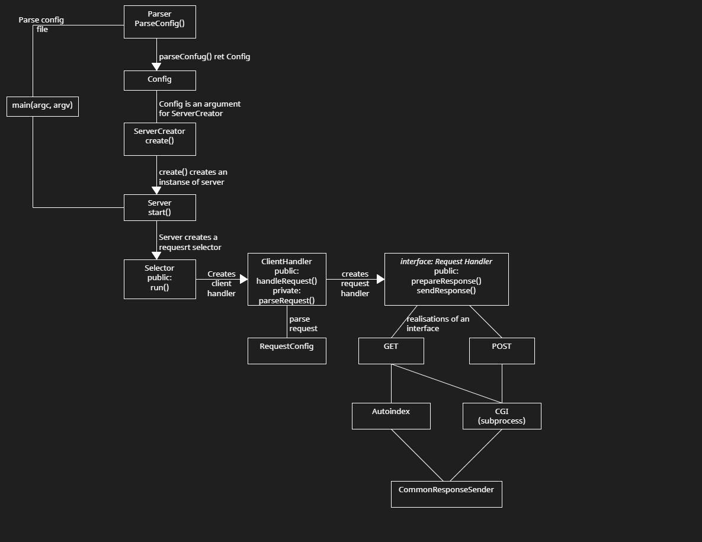

### Project goal and supported features
My own basic HTTP/1.1 server implementation that can handle:
- GET method 
- POST method 
- CGI
- Aliasing for resourses
- Autoindex
- Multitasking (via thread pool)

### How it looks on server side

### How it looks in browser

### Project modules scheme


### How to build and start the project

    cd $PROJECT_ROOT
    make
    ./webser path-to-config
If you have some errors during working with project you can see condition of some underlying collections using extra key for make command - make MODE=Debug

### Configuration file
Take a look at $PROJECT_ROOT/config/sample.conf to see how example from gifs is configured
```
# directive to create a virtual server
# only one server can be set so far
server  {
# server name that will appear in server responses
	server_name  example.com

# server_root is telling server which folder is allowed for asking in request,
# so that nobody could have access to system files using autoindex
	server_root  /path/

# listen lexem tells server what ip-address and port is being listened
	listen  127.0.0.1:8080

# tells server how much threads to use, if doesn't set server will use all available in system
		working_threads  6

# location directive is an alias for files, folders or cgi scripts, 
# can use enviroment variables in the path
	location  /  {
		root  $ROOT
	}
	location  /  {
		root  /path
	}

# for GET request locations in url will be processed through CGI only in this directory
# also POST requests will return 404 if this directive isn't set
	cgi_dir  $ROOT/test_files/cgi-bin

# this directive tells server which files extentions are valid for CGI
# and specifies interpreter for scripts
	cgi_server_pass  .py  {
		cgi_pass  /usr/bin/python3
	}
	
# binary allowing to use compiled files for CGI without any intrepreters
	cgi_server_pass  binary
}
```
